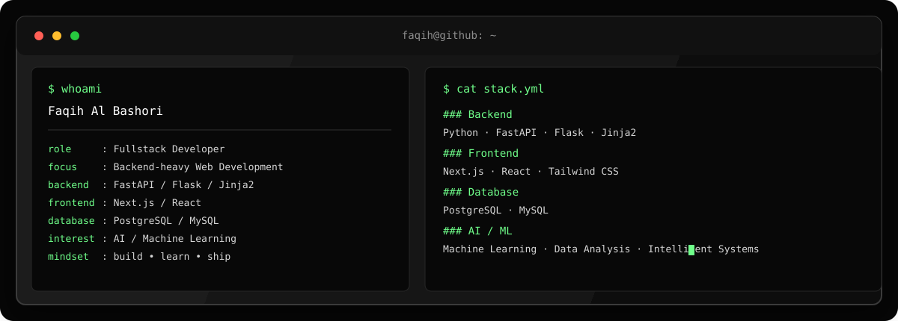

<div align="center">



<br>

<a href="https://github.com/ElFaqih-B">
  
</a>
<a href="https://github.com/ElFaqih-B?tab=repositories">
  
</a>

</div>

## `$ whoami`

> **Faqih Al Bashori** — Fullstack Developer focused on building useful web systems, backend services, and exploring AI/ML.

```text
backend   → FastAPI · Flask · Jinja2
frontend  → Next.js · React
database  → PostgreSQL · MySQL
interest  → AI · Machine Learning · Intelligent Systems
```

## `$ ls ~/toolbox`

<p align="center">
  
</p>

## `$ ./projects`

<table>
<tr>
<td width="33%" valign="top">

### My Finance
Personal finance system for transaction processing and financial tracking.

`FastAPI` `PostgreSQL` `React Native`

</td>
<td width="33%" valign="top">

### Kos Omah
Fullstack boarding-house management platform with an admin backend.

`Next.js` `FastAPI` `MySQL`

</td>
<td width="33%" valign="top">

### Intensive Portal
Academic and organizational management system.

`Laravel` `React` `PostgreSQL`

</td>
</tr>
</table>

## `$ cat now.txt`

```text
building      → fullstack systems
learning      → backend architecture + AI/ML
experimenting → automation + intelligent applications
```

<div align="center">

`build` → `break` → `learn` → `improve`

<br><br>

```bash
$ echo "build useful things."
build useful things.
```

</div>
